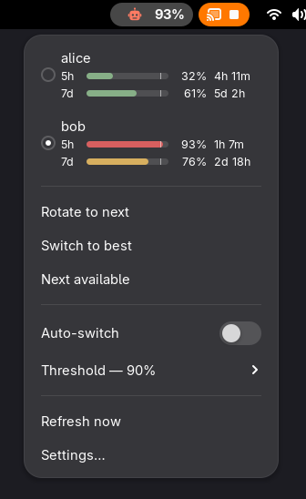

# Claude Swap — GNOME Shell indicator

A GNOME Shell top-bar indicator for [claude-swap](https://github.com/realiti4/claude-swap),
the multi-account switcher for Claude Code. It shows how close the active account is to
its rate limits and lets you switch accounts without opening a terminal.

This is a port of `cswap menubar` — claude-swap's macOS menu bar app, which is built on
`rumps` and does not run on Linux.



*Screenshot uses placeholder accounts.*

Each account gets a bar per window. The `┃` tick marks the auto-switch trigger, so you can
see at a glance how much headroom is left before a switch fires.

Severity follows claude-swap's own TUI: normal below 70%, amber from 70%, and red at your
configured `autoswitch.threshold` (90% by default) — so the colour and the switching
behaviour always agree. Raise the threshold and the red band moves with it. The panel icon
uses the same bands, driven by the tightest of the two windows, plus the accent colour
briefly after an auto-switch fires.

## Requirements

- GNOME Shell 50
- [claude-swap](https://github.com/realiti4/claude-swap) on the machine

The extension shells out to `cswap` and parses its documented `--json` output
(`schemaVersion: 1`). It re-implements no account, usage, or auto-switch logic of its own.

## Installing claude-swap

```bash
uv tool install claude-swap     # or: pipx install claude-swap
cswap add                       # register your current login
cswap list                      # confirm it sees your accounts
```

See the [claude-swap README](https://github.com/realiti4/claude-swap) for adding further
accounts, setup tokens, and directory mappings.

## Installing the extension

```bash
git clone <this repo> ~/.local/share/gnome-shell/extensions/claude-swap@danieljones.net
cd ~/.local/share/gnome-shell/extensions/claude-swap@danieljones.net
/usr/bin/glib-compile-schemas schemas/
gnome-extensions enable claude-swap@danieljones.net
```

The directory name must match the `uuid` in `metadata.json` exactly, or GNOME will not
load it.

Use the absolute `/usr/bin/glib-compile-schemas`. If you have Homebrew on your `PATH` it
shadows the system copy, and a version skew between the two produces a `gschemas.compiled`
the shell cannot read.

**Enabling requires a logout and login.** GNOME 50 on Wayland has no live reload —
`Alt+F2 r` does not exist and the `ReloadExtension` D-Bus method is deprecated and
non-functional. Writing the setting is enough; it takes effect at your next login.
*Disabling*, by contrast, is immediate, so rolling back never needs a logout.

## If the menu says "cswap not found"

This is the most likely first-run failure, and it is not your install being broken.

GNOME Shell's environment is not your shell's. Its `PATH` is typically just
`/usr/local/sbin:/usr/local/bin:/usr/bin` — it does **not** include `~/.local/bin`, which
is exactly where `uv` and `pipx` put `cswap`. So `cswap` works in every terminal you try
and is invisible to the extension.

The extension handles this by resolving an absolute path itself, trying in order:

1. the **Path to cswap** setting, if you have set one
2. `cswap` on `PATH`
3. `~/.local/bin/cswap`
4. `~/.local/share/uv/tools/claude-swap/bin/cswap`

If none of those is an executable file, the menu says so and lists the paths it tried.
Set **Path to cswap** in the extension's preferences to fix it. A path you set there is
authoritative — the extension will not quietly fall back to a different binary.

```bash
command -v cswap        # what your terminal resolves
systemctl --user show-environment | grep '^PATH'   # what the shell sees
```

## Settings

| Setting | Default | What it does |
|---|---|---|
| Percentages beside the icon | Tightest window | `none`, tightest, 5-hour, 7-day, or both |
| Show account name | off | Prefix the panel text with the account alias or email local part |
| Colour the icon by usage | on | Amber above 80%, red above 95% |
| Refresh interval | 60s | How often usage is re-read (30–600) |
| Notify on auto-switch | on | Manual switches are never announced — you just made them |
| Path to cswap | auto-detect | See above |

**Auto-switch policy is not stored by this extension.** The threshold submenu writes
`autoswitch.threshold` through `cswap config set`, so the panel, `cswap auto` in a
terminal, and the TUI all share one source of truth. Changing the threshold in the panel
changes it everywhere.

The `Auto-switch` toggle itself is local to the extension: it controls whether *this*
process runs a tick, matching the macOS menu bar, where the engine lives and dies with the
GUI. It does not survive a shell restart, and it is not a background service.

## How it refreshes

One timer at the configured interval runs `cswap list --json`. This is cheap (~140ms) and
self-limiting: claude-swap keeps its own poll policy (`nextPollAt`, `pollIntervalS`), so
repeated calls do not hit the network every time.

With auto-switch on, each tick then runs `cswap auto --once --json` and reads its exit
code — `0` switched, `1` error, `2` no action needed, `3` blocked. A blocked state is
notified at most once an hour, so an all-accounts-exhausted situation does not produce a
notification every minute.

Nothing is allowed to blank the panel. A failed refresh keeps the last good reading and
labels it `stale — last read Nm ago`; three consecutive failures back the interval off to
five minutes until one succeeds.

## Development

```bash
/usr/bin/gjs -m tests/run.js     # 90 tests, no shell restart needed
```

`format.js` imports nothing from `gi://`, which is what lets the display logic run under
plain `gjs` outside a shell. `cswap.js` is the only module that spawns a process, and
`tests/stub-cswap.sh` stands in for the real binary — driven by `STUB_STDOUT`,
`STUB_STDERR`, `STUB_EXIT` and `STUB_SLEEP` — so the tests never touch real credentials.

For live testing, run a nested shell rather than restarting your session:

```bash
dbus-run-session -- gnome-shell --devkit --wayland --wayland-display=wayland-dev
```

Two traps worth knowing. A nested shell killed with `SIGTERM` leaves
`/run/user/$UID/gnome-shell-disable-extensions` behind, and the next start reads that as
"an extension crashed us" and moves your extension into `disabled-extensions` — silently,
for that dconf database. Remove the file before each run. And exercise the auto-switch
path with `cswap auto --once --dry-run`, which decides and logs without touching
credentials.

## Scope

Monitoring and switching only. Adding, removing, disabling accounts and refreshing
credentials stay in `cswap` and `cswap tui`, which have better affordances for them than a
panel menu — particularly the OAuth browser flow and destructive confirmations.

Bars are drawn with Cairo rather than assembled from block glyphs the way the TUI does it:
the menu is set in Cantarell, which is proportional, so glyph runs would come out ragged
and the tick would drift off the value it marks. The geometry is a pure function in
`format.js` and unit-tested; `usagebar.js` only paints.

## Credits

claude-swap is by Onur Cetinkol — <https://github.com/realiti4/claude-swap> (MIT).
This extension is an independent GNOME port of its menu bar UI and is not affiliated with
that project.
